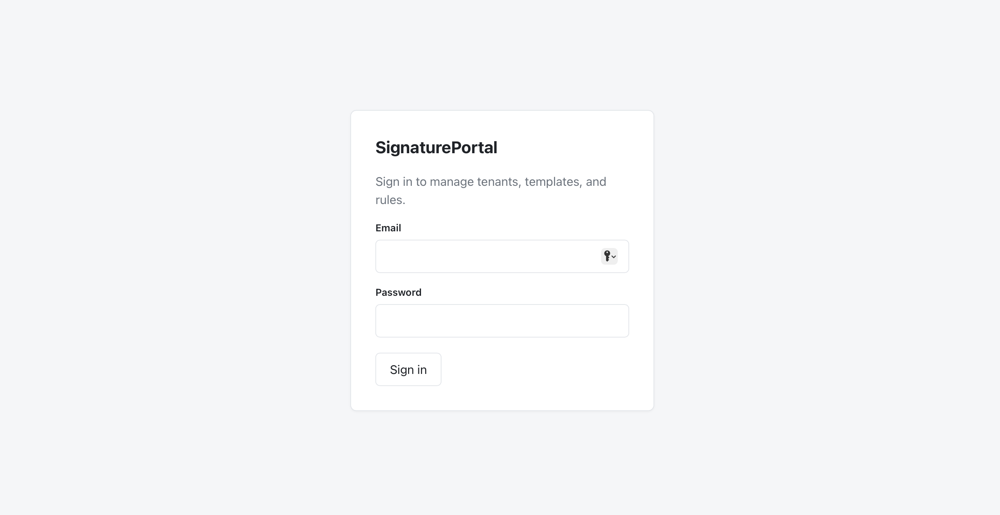
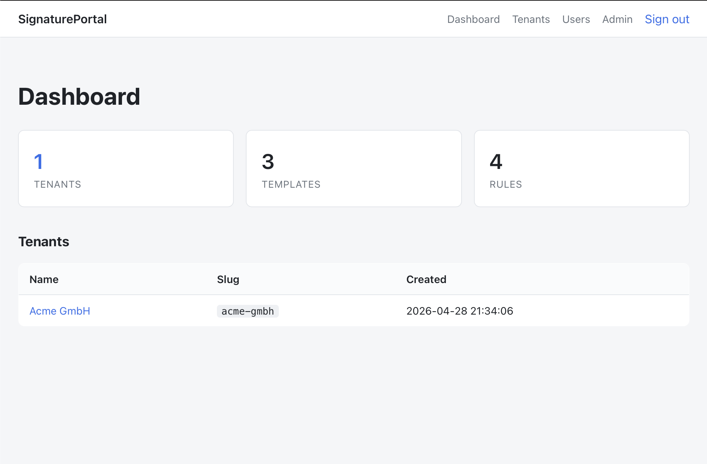
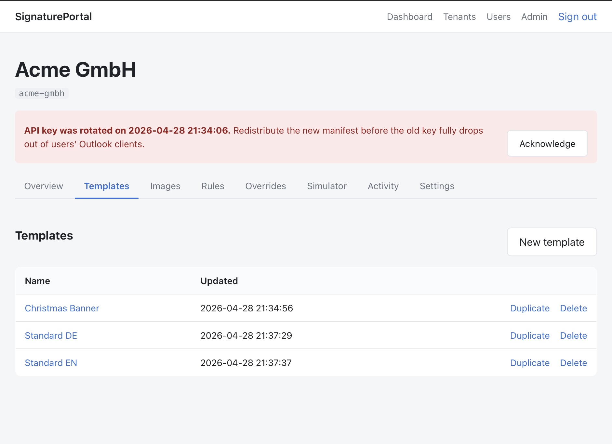
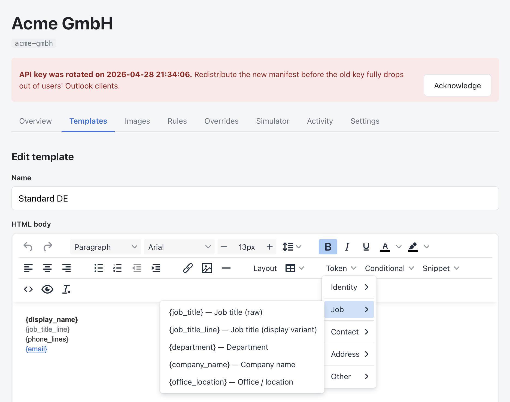
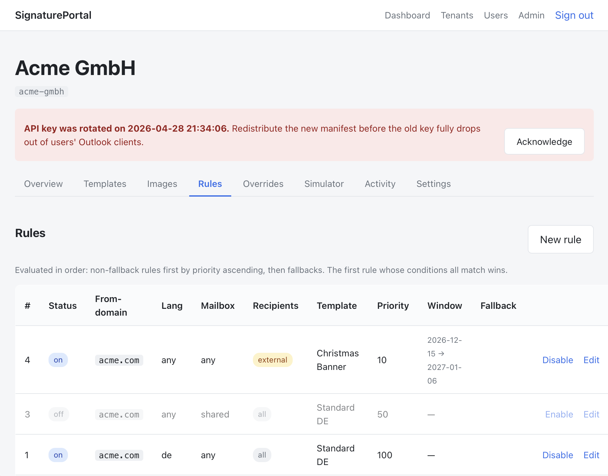
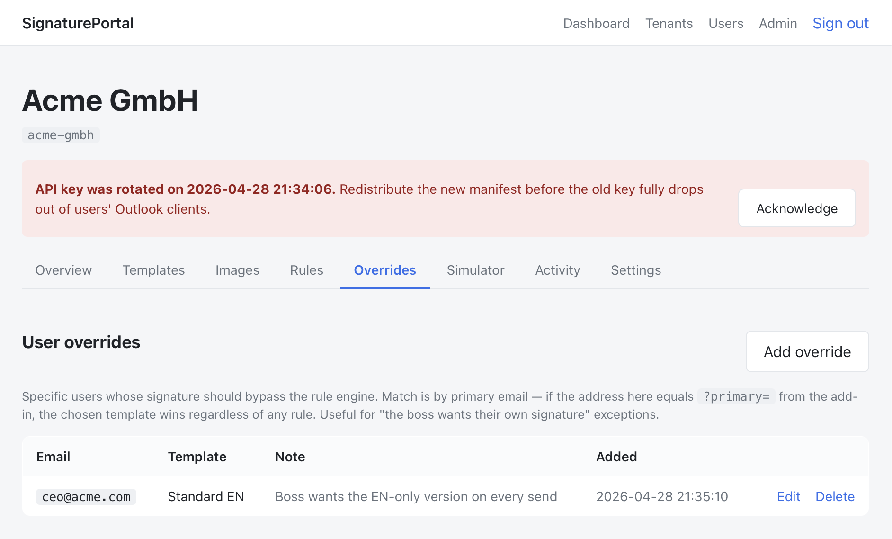
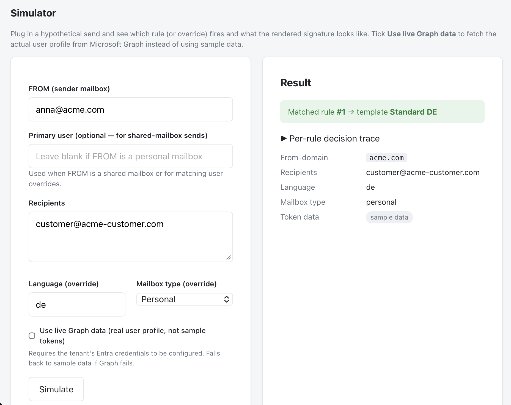

# SignaturePortal

> Self-hosted email signature management for Microsoft 365 — runs on shared PHP hosting.

SignaturePortal is an open-source alternative to commercial signature managers. It centrally manages Outlook signature templates and delivers the right one to each user at the moment they compose an email, using a lightweight Outlook Add-in.

It is designed to run on **inexpensive shared PHP hosting** — IONOS, Strato, all-inkl, HostEurope, or any LAMP-style host with mod_rewrite. No Node.js, no Docker, no dedicated server required, no shell access required at runtime.

## Screenshots

<table>
  <tr>
    <td width="50%">
      <a href=".github/screenshots/LoginScreen.png">
        
      </a>
      <em>Sign in with a local account or — if a tenant has Entra SSO configured — with one click via Microsoft.</em>
    </td>
    <td width="50%">
      <a href=".github/screenshots/Dashboard.png">
        
      </a>
      <em>Cross-tenant dashboard for superadmins; tenant-scoped editors land on their own tenant only.</em>
    </td>
  </tr>
  <tr>
    <td width="50%">
      <a href=".github/screenshots/Templates.png">
        
      </a>
      <em>Templates list — pick from a starter library, duplicate an existing one, or write your own.</em>
    </td>
    <td width="50%">
      <a href=".github/screenshots/Editor.png">
        
      </a>
      <em>TinyMCE template editor — Token / Conditional / Snippet menus, drag-and-drop image upload, line-height + free-text font-size, width-toggleable live preview (Desktop / Tablet / Mobile).</em>
    </td>
  </tr>
  <tr>
    <td width="50%">
      <a href=".github/screenshots/Rules.png">
        
      </a>
      <em>Rule engine — priorities, recipient scope (internal/external), validity windows for seasonal banners, plus an enable/disable toggle so you can park a rule without deleting it.</em>
    </td>
    <td width="50%">
      <a href=".github/screenshots/Overrides.png">
        
      </a>
      <em>Per-user overrides — pin a specific address to a specific template, with a free-text note for future you. Sits above the rule engine.</em>
    </td>
  </tr>
  <tr>
    <td colspan="2">
      <a href=".github/screenshots/Simulator.png">
        
      </a>
      <em>Simulator — plug in any FROM/recipient combination (optionally against live Microsoft Graph data), see which rule or override the engine picks, why each other rule didn't match, and what the final signature renders like.</em>
    </td>
  </tr>
</table>

## Features

- **Browser-based template editor** (TinyMCE) — write signature HTML, preview live, use `{placeholder}` tokens, drag-and-drop images straight into a per-tenant asset library.
- **Rule engine** — pick the right template based on FROM domain, user language, mailbox type (personal / shared), recipient scope (internal / external), priority, and an optional date validity window.
- **Conditional template syntax** — `{if:mobile_phone}…{/if}` blocks disappear automatically when a Graph attribute is empty.
- **Per-user overrides** — bypass the rule engine for specific addresses ("the boss wants their own signature").
- **Multi-tenant** — manage multiple organisations from one installation, each with its own Entra app, image library, templates, and rules.
- **Two portal auth modes** — local accounts (bcrypt + lockout after 5 failed attempts, self-service password reset via email) and Microsoft Entra ID SSO with optional auto-provisioning.
- **Per-tenant API key** — rotatable from the portal, banner reminds admins to redistribute the manifest.
- **Shared mailbox support** — detects shared mailboxes via the `assignedLicenses` heuristic, falls back to the original sender's profile, and either keeps the shared address or derives a personal-style address per tenant preference.
- **Audit log** — every template / rule / override / key-rotation / user change is recorded with actor + IP.
- **Live simulator** — pick a real Graph user, see exactly which rule fires and what the rendered signature looks like before publishing.
- **Single-package deployment** — drop the directory into your web root, run the installer, done.
- **No build step** — pure PHP + Twig + vanilla JS; Office.js loaded from CDN.

## Architecture

```
                       ┌───────────────────────┐
                       │   Shared PHP host     │
                       │   ┌───────────────┐   │
   Outlook Add-in ─────┼──▶│  Portal (PHP) │   │
   (Office.js, browser)│   │   - Web UI    │   │
                       │   │   - Sig API   │──┼──▶ MS Graph API
                       │   └───────┬───────┘   │
                       │           │           │
                       │   ┌───────▼───────┐   │
                       │   │   MySQL DB    │   │
                       │   └───────────────┘   │
                       └───────────────────────┘
```

The same PHP app serves both the management portal and the signature delivery API. Tenant configuration, templates, rules, overrides, and audit log live in MySQL. User profile data (name, title, phone, full address, etc.) is fetched live from Microsoft Graph using stored per-tenant client credentials.

## Where it runs (and where it doesn't)

| Outlook client | Auto-applied signature | Manual ribbon button |
|---|---|---|
| Outlook on the web (OWA) | ✅ | ✅ |
| New Outlook for Windows | ✅ | ✅ |
| Classic Outlook for Windows (Version 2304+) | ✅ | ✅ |
| Outlook for Mac (16.77+) | ✅ | ✅ |
| Outlook iOS / Android | ✅ | ❌ |

The signature is applied when composing starts and re-fetched automatically when the **FROM address** changes (e.g. switching to a shared mailbox — including popped-out compose windows) or the **recipients** change (so recipient-scoped rules can swap the template).

On **mobile** (Outlook for iOS/Android), event-based signatures require an Exchange Online account and a reasonably current app version (new-message compose since 4.2352.0, FROM switching since 4.2502.0). Outlook mobile itself doesn't support shared-mailbox FROM switching, so on phones the signature applies to the user's own account. Clients older than the versions above fall back to the manual ribbon button (desktop) or no signature (mobile).

## Requirements

- PHP **8.1+** (tested up to 8.4)
- MySQL **5.7+** or MariaDB **10.3+**
- HTTPS (Outlook refuses to load add-ins over HTTP)
- A Microsoft Entra (Azure AD) app registration **per tenant**, with the `User.Read.All` application permission (admin-consented). The same registration powers Graph signature delivery and Entra SSO.

PHP extensions used: `pdo`, `pdo_mysql`, `curl`, `mbstring`, `openssl`, `sodium`, `json`, `dom`. All ship by default on every mainstream PHP host.

## Quick start

A full step-by-step walkthrough — shared-host deployment, Entra app setup, manifest generation, sideloading, troubleshooting — lives in [SETUP.md](SETUP.md).

The five-second version:

```bash
# 1. Get the code on the host
git clone https://github.com/finezzo/signature-portal.git
# 2. Point your subdomain at <project>/public/
# 3. Visit https://your-domain/install.php, paste the install token from
#    config/.install_token (proves server access), fill the form
# 4. DELETE public/install.php right after the success page
# 5. Log in, create a tenant, upload images, write templates, define rules
# 6. Download the OfficeApp manifest from the tenant page, sideload into Outlook
```

## Configuration reference

All runtime config lives in `config/config.php`. The installer creates it; you can edit it later.

| Key | Purpose |
|---|---|
| `db.*` | MySQL host, port, name, user, password |
| `app_key` | 32-byte key for at-rest secret encryption (`base64:...`). **Do not change after install** — existing encrypted Entra secrets and API keys become unrecoverable. |
| `base_url` | Public HTTPS URL of the install (no trailing slash) |
| `debug` | When `true`, unhandled exceptions render full stack traces in the browser. **Never set true in production.** |
| `auth.local.enabled` | Allow local password login |
| `auth.entra.enabled` | (Reserved — Entra SSO is configured per-tenant in the portal UI) |
| `session.name` / `session.lifetime` | Portal session cookie name and lifetime in minutes |
| `mail.from` / `mail.from_name` | Sender for transactional mail (password reset links), sent via PHP `mail()` — no SMTP credentials needed. Defaults to `no-reply@<host of base_url>`. |

## Security notes

- **`/api/sig` is key-protected and rate-limited** — anyone with the API key can fetch signatures for that tenant, so treat it like a secret. Rotation is one click in the portal; the old key stops working immediately and the portal banners you to redistribute the manifest. DB-backed rate limits (per tenant, plus per-IP on auth failures) cap what a leaked key can enumerate and slow down key guessing.
- **Secrets are encrypted at rest** with `APP_KEY` (libsodium `crypto_secretbox`): per-tenant Entra client secrets, API keys, and cached Microsoft Graph access tokens. If you lose `APP_KEY`, you must re-enter Entra credentials for every tenant.
- **Graph token values are HTML-escaped at render time** — a hostile value in a self-service Entra attribute (display name, `aboutMe`, …) can't inject markup into delivered signatures.
- **HTTPS is required.** Outlook will refuse to load the add-in over HTTP. Session cookies are marked `Secure` when `base_url` is `https://` **or** the request itself arrives over TLS.
- **HTML templates are sanitised on save** with HTML Purifier — stored XSS in the portal is mitigated even if a tenant editor pastes hostile HTML.
- **CSRF tokens** on every state-changing form, rotated on login; `session.use_strict_mode` blocks fixated session IDs. The `/api/*` namespace is exempt because it is API-key-authenticated, not session-authenticated.
- **Failed-login lockout** — 5 wrong attempts in 10 minutes locks the local account for 15 minutes, with constant-time handling that doesn't leak which emails have an account. SSO sign-ins are unaffected.
- **Password changes end other sessions** — any password change (self-service, admin reset, or reset link) immediately invalidates every other session of that user. Reset links are single-use, stored only as SHA-256 hashes, and expire after 30 minutes.
- **Installer is token-gated** — `public/install.php` requires a one-time token written to `config/.install_token` (outside the web root), so a freshly deployed instance can't be claimed by a stranger. Delete the installer after use anyway.
- **Hardening headers** — `X-Content-Type-Options: nosniff`, `X-Frame-Options: SAMEORIGIN`, `Referrer-Policy: strict-origin-when-cross-origin` in `public/.htaccess`; a Content-Security-Policy for the portal UI is set in PHP (`SecurityHeadersMiddleware`). `config/`, `var/`, and `migrations/` carry deny-all `.htaccess` files as a safety net against docroot misconfiguration.
- **Append-only audit log** — every mutation (template, rule, override, user, API key) is recorded with actor email and IP, viewable per tenant under *Activity*.

## Roadmap

- Per-tenant branding (logo, accent colour) in the portal UI
- Template version history with rollback
- Localisation of the portal UI
- 2FA for local portal accounts
- SMTP transport option for transactional mail (currently PHP `mail()`)

Issues and PRs welcome.

## Disclaimer

> **THIS SOFTWARE IS PROVIDED "AS IS", WITHOUT WARRANTY OF ANY KIND, EXPRESS OR IMPLIED, INCLUDING BUT NOT LIMITED TO THE WARRANTIES OF MERCHANTABILITY, FITNESS FOR A PARTICULAR PURPOSE, AND NONINFRINGEMENT. IN NO EVENT SHALL THE AUTHORS OR COPYRIGHT HOLDERS BE LIABLE FOR ANY CLAIM, DAMAGES, OR OTHER LIABILITY, WHETHER IN AN ACTION OF CONTRACT, TORT OR OTHERWISE, ARISING FROM, OUT OF, OR IN CONNECTION WITH THE SOFTWARE OR THE USE OR OTHER DEALINGS IN THE SOFTWARE.**

You are solely responsible for evaluating whether this software meets your operational, security, and compliance requirements. The authors make no representation that the software is suitable for processing personal data under GDPR or any other regulation; you are responsible for performing your own data-protection impact assessment, configuring access controls appropriately, and securing the credentials you store in it. The Microsoft Graph integration accesses user directory data — review your tenant's privacy and consent policies before deployment.

This project is not affiliated with, endorsed by, or sponsored by Microsoft Corporation. "Outlook", "Microsoft 365", "Entra", and "Azure" are trademarks of Microsoft Corporation. Other product or company names mentioned in this documentation may be trademarks of their respective owners.

## License

Apache License 2.0 — see [LICENSE](LICENSE).

This project bundles vendored dependencies under their own licences (so it can be deployed without `composer install` on the server). Notable: `ezyang/htmlpurifier` is **LGPL-2.1-or-later**, which is compatible with Apache-2.0 distribution. All other vendored packages are MIT or BSD-style. The full dependency list lives under `vendor/<vendor-name>/<package>/LICENSE`.

## Contributing

PRs welcome. Please:

1. Open an issue first for non-trivial changes.
2. Match existing code style (`declare(strict_types=1)`, PSR-12).
3. Add tests for behaviour changes.
4. Do not introduce dependencies that need a build step or shell access on the server — the lowest common denominator is shared PHP hosting without SSH.
